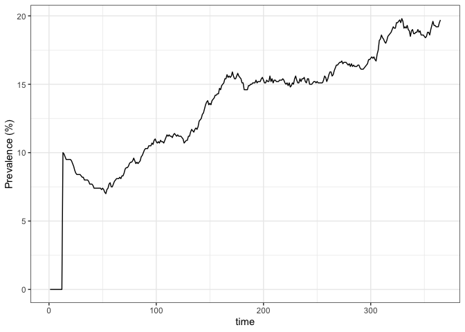
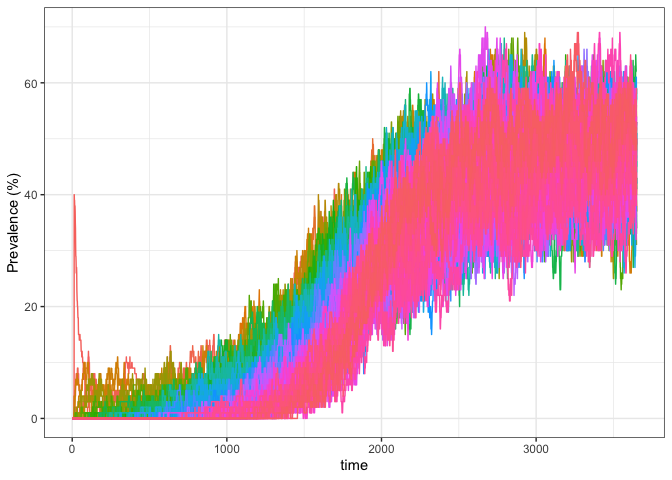
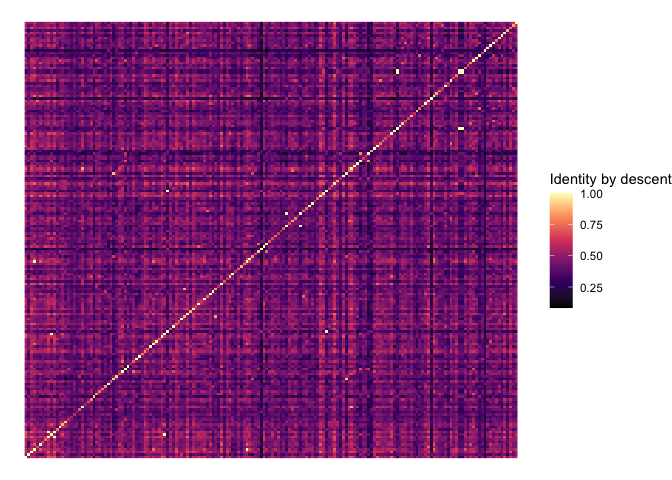
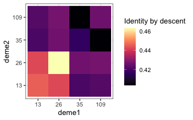

<!-- README.md is generated from README.Rmd. Please edit that file -->

# PlasmoSim

<!-- badges: start -->

[](https://github.com/mrc-ide/PlasmoSim/actions)
[](https://github.com/mrc-ide/PlasmoSim/actions)
<!-- badges: end -->

PlasmoSim is an R package for simulating both epidemiological and
genetic data from a simple model of Plasmodium falciparum transmission.
The model itself is fairly lightweight, which speeds up computation
times and in turn increases the number of demes (partially isolated
sub-populations) that we can simulate. This allows us to explore
interesting questions relating to spatial patterns of P. falciparum
genetic structure.

## Installation

You can install the development version of PlasmoSim from
[GitHub](https://github.com/) with:

``` r
# install.packages("devtools")
devtools::install_github("mrc-ide/PlasmoSim")
```

Now we can load the Plasmosim package, along with others that will be
useful:

``` r
# load packages
library(PlasmoSim)
library(ggplot2)
library(tidyverse)
```

## Example

PlasmoSim returns two types of output:

1.  Population-level data giving basic epidemiological measures
    (e.g. prevalence) on each day of simulation
2.  Individual-level data, including parasite genotypes found in the
    host at specific sampling points

For the latter, we need to define our desired sampling strategy using a
data.frame. This specifies the demes that we will sample from, at what
time points, and how many hosts will be drawn at random from the
population:

``` r
# define individual-level sampling via a data.frame
sample_df <- data.frame(deme = 1,
                        time = 365,
                        n = 100)
```

Now we run the main simulation function:

``` r
# run simulation
sim1 <- sim_falciparum(H = 1000,                     # human population size
                       M = 5000,                     # adult female mosquito population size
                       seed_infections = 100,        # number of infected hosts at time 0
                       L = 24,                       # number of loci
                       sample_dataframe = sample_df  # sampling data.frame
                       )
#> Running simulation
#>   |                                                                              |                                                                      |   0%  |                                                                              |                                                                      |   1%  |                                                                              |=                                                                     |   1%  |                                                                              |=                                                                     |   2%  |                                                                              |==                                                                    |   2%  |                                                                              |==                                                                    |   3%  |                                                                              |==                                                                    |   4%  |                                                                              |===                                                                   |   4%  |                                                                              |===                                                                   |   5%  |                                                                              |====                                                                  |   5%  |                                                                              |====                                                                  |   6%  |                                                                              |=====                                                                 |   7%  |                                                                              |=====                                                                 |   8%  |                                                                              |======                                                                |   8%  |                                                                              |======                                                                |   9%  |                                                                              |=======                                                               |   9%  |                                                                              |=======                                                               |  10%  |                                                                              |=======                                                               |  11%  |                                                                              |========                                                              |  11%  |                                                                              |========                                                              |  12%  |                                                                              |=========                                                             |  12%  |                                                                              |=========                                                             |  13%  |                                                                              |==========                                                            |  14%  |                                                                              |==========                                                            |  15%  |                                                                              |===========                                                           |  15%  |                                                                              |===========                                                           |  16%  |                                                                              |============                                                          |  16%  |                                                                              |============                                                          |  17%  |                                                                              |============                                                          |  18%  |                                                                              |=============                                                         |  18%  |                                                                              |=============                                                         |  19%  |                                                                              |==============                                                        |  19%  |                                                                              |==============                                                        |  20%  |                                                                              |==============                                                        |  21%  |                                                                              |===============                                                       |  21%  |                                                                              |===============                                                       |  22%  |                                                                              |================                                                      |  22%  |                                                                              |================                                                      |  23%  |                                                                              |================                                                      |  24%  |                                                                              |=================                                                     |  24%  |                                                                              |=================                                                     |  25%  |                                                                              |==================                                                    |  25%  |                                                                              |==================                                                    |  26%  |                                                                              |===================                                                   |  27%  |                                                                              |===================                                                   |  28%  |                                                                              |====================                                                  |  28%  |                                                                              |====================                                                  |  29%  |                                                                              |=====================                                                 |  29%  |                                                                              |=====================                                                 |  30%  |                                                                              |=====================                                                 |  31%  |                                                                              |======================                                                |  31%  |                                                                              |======================                                                |  32%  |                                                                              |=======================                                               |  32%  |                                                                              |=======================                                               |  33%  |                                                                              |========================                                              |  34%  |                                                                              |========================                                              |  35%  |                                                                              |=========================                                             |  35%  |                                                                              |=========================                                             |  36%  |                                                                              |==========================                                            |  36%  |                                                                              |==========================                                            |  37%  |                                                                              |==========================                                            |  38%  |                                                                              |===========================                                           |  38%  |                                                                              |===========================                                           |  39%  |                                                                              |============================                                          |  39%  |                                                                              |============================                                          |  40%  |                                                                              |============================                                          |  41%  |                                                                              |=============================                                         |  41%  |                                                                              |=============================                                         |  42%  |                                                                              |==============================                                        |  42%  |                                                                              |==============================                                        |  43%  |                                                                              |==============================                                        |  44%  |                                                                              |===============================                                       |  44%  |                                                                              |===============================                                       |  45%  |                                                                              |================================                                      |  45%  |                                                                              |================================                                      |  46%  |                                                                              |=================================                                     |  47%  |                                                                              |=================================                                     |  48%  |                                                                              |==================================                                    |  48%  |                                                                              |==================================                                    |  49%  |                                                                              |===================================                                   |  49%  |                                                                              |===================================                                   |  50%  |                                                                              |===================================                                   |  51%  |                                                                              |====================================                                  |  51%  |                                                                              |====================================                                  |  52%  |                                                                              |=====================================                                 |  52%  |                                                                              |=====================================                                 |  53%  |                                                                              |======================================                                |  54%  |                                                                              |======================================                                |  55%  |                                                                              |=======================================                               |  55%  |                                                                              |=======================================                               |  56%  |                                                                              |========================================                              |  56%  |                                                                              |========================================                              |  57%  |                                                                              |========================================                              |  58%  |                                                                              |=========================================                             |  58%  |                                                                              |=========================================                             |  59%  |                                                                              |==========================================                            |  59%  |                                                                              |==========================================                            |  60%  |                                                                              |==========================================                            |  61%  |                                                                              |===========================================                           |  61%  |                                                                              |===========================================                           |  62%  |                                                                              |============================================                          |  62%  |                                                                              |============================================                          |  63%  |                                                                              |============================================                          |  64%  |                                                                              |=============================================                         |  64%  |                                                                              |=============================================                         |  65%  |                                                                              |==============================================                        |  65%  |                                                                              |==============================================                        |  66%  |                                                                              |===============================================                       |  67%  |                                                                              |===============================================                       |  68%  |                                                                              |================================================                      |  68%  |                                                                              |================================================                      |  69%  |                                                                              |=================================================                     |  69%  |                                                                              |=================================================                     |  70%  |                                                                              |=================================================                     |  71%  |                                                                              |==================================================                    |  71%  |                                                                              |==================================================                    |  72%  |                                                                              |===================================================                   |  72%  |                                                                              |===================================================                   |  73%  |                                                                              |====================================================                  |  74%  |                                                                              |====================================================                  |  75%  |                                                                              |=====================================================                 |  75%  |                                                                              |=====================================================                 |  76%  |                                                                              |======================================================                |  76%  |                                                                              |======================================================                |  77%  |                                                                              |======================================================                |  78%  |                                                                              |=======================================================               |  78%  |                                                                              |=======================================================               |  79%  |                                                                              |========================================================              |  79%  |                                                                              |========================================================              |  80%  |                                                                              |========================================================              |  81%  |                                                                              |=========================================================             |  81%  |                                                                              |=========================================================             |  82%  |                                                                              |==========================================================            |  82%  |                                                                              |==========================================================            |  83%  |                                                                              |==========================================================            |  84%  |                                                                              |===========================================================           |  84%  |                                                                              |===========================================================           |  85%  |                                                                              |============================================================          |  85%  |                                                                              |============================================================          |  86%  |                                                                              |=============================================================         |  87%  |                                                                              |=============================================================         |  88%  |                                                                              |==============================================================        |  88%  |                                                                              |==============================================================        |  89%  |                                                                              |===============================================================       |  89%  |                                                                              |===============================================================       |  90%  |                                                                              |===============================================================       |  91%  |                                                                              |================================================================      |  91%  |                                                                              |================================================================      |  92%  |                                                                              |=================================================================     |  92%  |                                                                              |=================================================================     |  93%  |                                                                              |==================================================================    |  94%  |                                                                              |==================================================================    |  95%  |                                                                              |===================================================================   |  95%  |                                                                              |===================================================================   |  96%  |                                                                              |====================================================================  |  96%  |                                                                              |====================================================================  |  97%  |                                                                              |====================================================================  |  98%  |                                                                              |===================================================================== |  98%  |                                                                              |===================================================================== |  99%  |                                                                              |======================================================================|  99%  |                                                                              |======================================================================| 100%
#> simulation completed in 0.0187707 seconds
#> processing output
```

Daily output is stored in long format, which makes it easy to produce
plots:

``` r
# basic plot of prevalence in "I" state (infected)
sim1$daily_values |>
  ggplot() + theme_bw() +
  geom_line(aes(x = time, y = 100 * I / 1000)) +
  ylab("Prevalence (%)")
```



We can see that prevalence jumped to 10% (100 infected hosts in the
population of 1000) on day 13. This is because we set the simulation
going with 100 seed infections, which here means new liver-stage
infections. The default time from liver-stage to blood-stage (the
intrinsic incubation period) is set to by default, hence these all
emerging together on day 13. After this point we can see dynamic and
stochastic changes in the number infected.

Individual-level output is also returned in long format. The first few
columns give basic properties of the hosts in our sample:

``` r
# take a peek at basic individual-level output, without the haplotypes column
sim1$indlevel %>%
  dplyr::select(-haplotypes) %>%
  head()
#>   time deme sample_ID positive
#> 1  365    1         1    FALSE
#> 2  365    1         3    FALSE
#> 3  365    1         6    FALSE
#> 4  365    1        39     TRUE
#> 5  365    1        57    FALSE
#> 6  365    1        64     TRUE
#>                                                                                               haplo_ID
#> 1                                                                                                 NULL
#> 2                                                                                                 NULL
#> 3                                                                                                 NULL
#> 4 0b63a0a63e4a38b802615f71392d892f, 0b63a0a63e4a38b802615f71392d892f, 0b63a0a63e4a38b802615f71392d892f
#> 5                                                                                                 NULL
#> 6                                                                     bb1d39364abb7393ca62503d8da1302b
```

The final column in this data.frame is a list of all haplotypes in the
hosts. For positive samples there can be a single haplotype or multiple
haplotypes if there was either a co-transmission or super-infection
event. Haplotypes are given in rows and loci in columns.

``` r
# view haplotypes found in the 35th sampled individual
sim1$indlevel$haplotypes[[35]]
#>      [,1] [,2] [,3] [,4] [,5] [,6] [,7] [,8] [,9] [,10] [,11] [,12] [,13] [,14]
#> [1,]   76   76   76   76   76   76   76   76   76    76    76    76    76    76
#>      [,15] [,16] [,17] [,18] [,19] [,20] [,21] [,22] [,23] [,24]
#> [1,]    76    76    76    76    76    76    76    76    76    76
```

The values in the cells are not alleles, but rather give the unique
ancestry at that locus. If two haplotypes have the same value at a given
locus then they are descended from the same ancestral sequence at some
earlier time in the simulation. These ancestry values can easily be
converted into allele frequencies by randomly assigning each ancestor to
an allele, for example ancestry 91 might correspond to an A allele, and
ancestry 51 a B allele.

## Example with migration

PlasmoSim incorporates migration of hosts between demes using a
migration matrix. We have to be careful when simulating stochastic
movement of people between demes, as if we simply give each person a
random chance of moving from one deme to another taken from this
migration matrix then deme population sizes will drift up and down at
random and eventually we will see demes emptying entirely. To get around
this we do matched migration, meaning people swap places between demes
rather than moving independently. This satisfies the migration matrix,
while also ensuring that population sizes stay constant throughout the
simulation. We do not model mosquito movement in this version of the
package.

We start by creating a grid of demes, and for each deme specifying its
properties, such as the mosquito population size and the number of
seeding infections. In our case we will make the density of mosquitoes
(and hence the EIR) increase from left to right of the domain. Note that
human population sizes must be the same for all demes due to the
migration constraint described above. We will start by seeding
infections in just one deme in the lower left corner:

``` r
# define x- and y-locations of demes
demes_x <- seq(0, 100, 10)
demes_y <- seq(0, 100, 10)

# get coordinates into dataframe
deme_df <- expand.grid(demes_x, demes_y)
names(deme_df) <- c("x", "y")

# add deme-specific properties
deme_df <- deme_df %>%
  dplyr::mutate(deme = seq_len(nrow(deme_df)),
                M = 500 + x, # mosquito population size increasing from left to right
                seed_infections = ifelse(x == 0 & y == 0, 50, 0))

head(deme_df)
#>    x y deme   M seed_infections
#> 1  0 0    1 500              50
#> 2 10 0    2 510               0
#> 3 20 0    3 520               0
#> 4 30 0    4 530               0
#> 5 40 0    5 540               0
#> 6 50 0    6 550               0
```

Next we need to make a migration matrix. We first calculate the distance
between all demes, and then we will create a small amount of migration
between adjacent demes only. The migration matrix must sum to one over
rows to be accepted by the program:

``` r
# define migration matrix based on distance
d <- deme_df %>%
  dplyr::select(x, y) %>%
  dist() %>%
  as.matrix()
mig_matrix <- 0.01 * (d <= 10)

# ensure migration probabilities sum to 1 over rows
diag(mig_matrix) <- 0
diag(mig_matrix) <- 1 - rowSums(mig_matrix)
```

Next we need to define our sampling strategy. We will sample 100
individuals from a subset of demes after a full 10 years of simulation
(genetic patterns take a long time to settle down, much longer than
prevalence for example). For convenience we produce the sampling
dataframe directly from the `deme_df` dataframe defined above, although
only the columns `deme`, `time` and `n` will be used sampling.

``` r
# define output dataframe
sample_df <- deme_df %>%
  dplyr::filter(deme %in% c(13, 26, 35, 109)) %>%
  dplyr::mutate(time = 30 * 365,
                n = 100)

sample_df
#>    x  y deme   M seed_infections  time   n
#> 1 10 10   13 510               0 10950 100
#> 2 30 20   26 530               0 10950 100
#> 3 10 30   35 510               0 10950 100
#> 4 90 90  109 590               0 10950 100
```

Now we can run the simulation, using the values in `deme_df` to specify
the mosquito population size and the seeding infections:

``` r
# simulate
set.seed(1)
sim_mig <- sim_falciparum(H = 100,
                          M = deme_df$M,
                          seed_infections = deme_df$seed_infections,
                          mig_matrix = mig_matrix,
                          L = 24,
                          sample_dataframe = sample_df)
#> Running simulation
#>   |                                                                              |                                                                      |   0%  |                                                                              |                                                                      |   1%  |                                                                              |=                                                                     |   1%  |                                                                              |=                                                                     |   2%  |                                                                              |==                                                                    |   2%  |                                                                              |==                                                                    |   3%  |                                                                              |==                                                                    |   4%  |                                                                              |===                                                                   |   4%  |                                                                              |===                                                                   |   5%  |                                                                              |====                                                                  |   5%  |                                                                              |====                                                                  |   6%  |                                                                              |=====                                                                 |   6%  |                                                                              |=====                                                                 |   7%  |                                                                              |=====                                                                 |   8%  |                                                                              |======                                                                |   8%  |                                                                              |======                                                                |   9%  |                                                                              |=======                                                               |   9%  |                                                                              |=======                                                               |  10%  |                                                                              |=======                                                               |  11%  |                                                                              |========                                                              |  11%  |                                                                              |========                                                              |  12%  |                                                                              |=========                                                             |  12%  |                                                                              |=========                                                             |  13%  |                                                                              |=========                                                             |  14%  |                                                                              |==========                                                            |  14%  |                                                                              |==========                                                            |  15%  |                                                                              |===========                                                           |  15%  |                                                                              |===========                                                           |  16%  |                                                                              |============                                                          |  16%  |                                                                              |============                                                          |  17%  |                                                                              |============                                                          |  18%  |                                                                              |=============                                                         |  18%  |                                                                              |=============                                                         |  19%  |                                                                              |==============                                                        |  19%  |                                                                              |==============                                                        |  20%  |                                                                              |==============                                                        |  21%  |                                                                              |===============                                                       |  21%  |                                                                              |===============                                                       |  22%  |                                                                              |================                                                      |  22%  |                                                                              |================                                                      |  23%  |                                                                              |================                                                      |  24%  |                                                                              |=================                                                     |  24%  |                                                                              |=================                                                     |  25%  |                                                                              |==================                                                    |  25%  |                                                                              |==================                                                    |  26%  |                                                                              |===================                                                   |  26%  |                                                                              |===================                                                   |  27%  |                                                                              |===================                                                   |  28%  |                                                                              |====================                                                  |  28%  |                                                                              |====================                                                  |  29%  |                                                                              |=====================                                                 |  29%  |                                                                              |=====================                                                 |  30%  |                                                                              |=====================                                                 |  31%  |                                                                              |======================                                                |  31%  |                                                                              |======================                                                |  32%  |                                                                              |=======================                                               |  32%  |                                                                              |=======================                                               |  33%  |                                                                              |=======================                                               |  34%  |                                                                              |========================                                              |  34%  |                                                                              |========================                                              |  35%  |                                                                              |=========================                                             |  35%  |                                                                              |=========================                                             |  36%  |                                                                              |==========================                                            |  36%  |                                                                              |==========================                                            |  37%  |                                                                              |==========================                                            |  38%  |                                                                              |===========================                                           |  38%  |                                                                              |===========================                                           |  39%  |                                                                              |============================                                          |  39%  |                                                                              |============================                                          |  40%  |                                                                              |============================                                          |  41%  |                                                                              |=============================                                         |  41%  |                                                                              |=============================                                         |  42%  |                                                                              |==============================                                        |  42%  |                                                                              |==============================                                        |  43%  |                                                                              |==============================                                        |  44%  |                                                                              |===============================                                       |  44%  |                                                                              |===============================                                       |  45%  |                                                                              |================================                                      |  45%  |                                                                              |================================                                      |  46%  |                                                                              |=================================                                     |  46%  |                                                                              |=================================                                     |  47%  |                                                                              |=================================                                     |  48%  |                                                                              |==================================                                    |  48%  |                                                                              |==================================                                    |  49%  |                                                                              |===================================                                   |  49%  |                                                                              |===================================                                   |  50%  |                                                                              |===================================                                   |  51%  |                                                                              |====================================                                  |  51%  |                                                                              |====================================                                  |  52%  |                                                                              |=====================================                                 |  52%  |                                                                              |=====================================                                 |  53%  |                                                                              |=====================================                                 |  54%  |                                                                              |======================================                                |  54%  |                                                                              |======================================                                |  55%  |                                                                              |=======================================                               |  55%  |                                                                              |=======================================                               |  56%  |                                                                              |========================================                              |  56%  |                                                                              |========================================                              |  57%  |                                                                              |========================================                              |  58%  |                                                                              |=========================================                             |  58%  |                                                                              |=========================================                             |  59%  |                                                                              |==========================================                            |  59%  |                                                                              |==========================================                            |  60%  |                                                                              |==========================================                            |  61%  |                                                                              |===========================================                           |  61%  |                                                                              |===========================================                           |  62%  |                                                                              |============================================                          |  62%  |                                                                              |============================================                          |  63%  |                                                                              |============================================                          |  64%  |                                                                              |=============================================                         |  64%  |                                                                              |=============================================                         |  65%  |                                                                              |==============================================                        |  65%  |                                                                              |==============================================                        |  66%  |                                                                              |===============================================                       |  66%  |                                                                              |===============================================                       |  67%  |                                                                              |===============================================                       |  68%  |                                                                              |================================================                      |  68%  |                                                                              |================================================                      |  69%  |                                                                              |=================================================                     |  69%  |                                                                              |=================================================                     |  70%  |                                                                              |=================================================                     |  71%  |                                                                              |==================================================                    |  71%  |                                                                              |==================================================                    |  72%  |                                                                              |===================================================                   |  72%  |                                                                              |===================================================                   |  73%  |                                                                              |===================================================                   |  74%  |                                                                              |====================================================                  |  74%  |                                                                              |====================================================                  |  75%  |                                                                              |=====================================================                 |  75%  |                                                                              |=====================================================                 |  76%  |                                                                              |======================================================                |  76%  |                                                                              |======================================================                |  77%  |                                                                              |======================================================                |  78%  |                                                                              |=======================================================               |  78%  |                                                                              |=======================================================               |  79%  |                                                                              |========================================================              |  79%  |                                                                              |========================================================              |  80%  |                                                                              |========================================================              |  81%  |                                                                              |=========================================================             |  81%  |                                                                              |=========================================================             |  82%  |                                                                              |==========================================================            |  82%  |                                                                              |==========================================================            |  83%  |                                                                              |==========================================================            |  84%  |                                                                              |===========================================================           |  84%  |                                                                              |===========================================================           |  85%  |                                                                              |============================================================          |  85%  |                                                                              |============================================================          |  86%  |                                                                              |=============================================================         |  86%  |                                                                              |=============================================================         |  87%  |                                                                              |=============================================================         |  88%  |                                                                              |==============================================================        |  88%  |                                                                              |==============================================================        |  89%  |                                                                              |===============================================================       |  89%  |                                                                              |===============================================================       |  90%  |                                                                              |===============================================================       |  91%  |                                                                              |================================================================      |  91%  |                                                                              |================================================================      |  92%  |                                                                              |=================================================================     |  92%  |                                                                              |=================================================================     |  93%  |                                                                              |=================================================================     |  94%  |                                                                              |==================================================================    |  94%  |                                                                              |==================================================================    |  95%  |                                                                              |===================================================================   |  95%  |                                                                              |===================================================================   |  96%  |                                                                              |====================================================================  |  96%  |                                                                              |====================================================================  |  97%  |                                                                              |====================================================================  |  98%  |                                                                              |===================================================================== |  98%  |                                                                              |===================================================================== |  99%  |                                                                              |======================================================================|  99%  |                                                                              |======================================================================| 100%
#> simulation completed in 9.03112 seconds
#> processing output
```

As before, we can produce a simple plot of prevalence over time, now
broken down by deme. We can see how the wave of infection swept through
the demes as infected hosts migrated through the space:

``` r
# basic plot of prevalence in "I" state (infected)
sim_mig$daily_values %>%
  dplyr::filter(time < 365 * 10) %>%
  ggplot() + theme_bw() +
  geom_line(aes(x = time, y = 100 * I / 100, col = as.factor(deme)), show.legend = FALSE) +
  ylab("Prevalence (%)")
```


We can visualise this spatially by filtering to a certain timepoint and
then producing a raster plot. For example, here is the prevalence map 5
years into the simulation:

``` r
# subset daily output to specific timepoint and merge back with deme properties
daily_values_sub <- sim_mig$daily_values %>%
  dplyr::filter(time == 5*365) %>%
  dplyr::left_join(deme_df, by = "deme")

# produce raster plot
daily_values_sub %>%
  ggplot() + theme_bw() +
  geom_raster(aes(x = x, y = y, fill = I)) +
  scale_fill_viridis_c(option = "magma", name = "Prevalence (%)")
```



We can see that five years into our simulation the wave of infection had
still not quite reached the top-right corner of our domain. Prevalence
also appears to be higher towards the right of the domain, a consequence
of assuming increasing mosquito population size from left to right. We
can produce the same plot at 30 years into simulation:

``` r
# subset daily output to specific timepoint and merge back with deme properties
daily_values_sub <- sim_mig$daily_values %>%
  dplyr::filter(time == 30*365) %>%
  dplyr::left_join(deme_df, by = "deme")

# produce raster plot
daily_values_sub %>%
  ggplot() + theme_bw() +
  geom_raster(aes(x = x, y = y, fill = I)) +
  scale_fill_viridis_c(option = "magma", name = "Prevalence (%)")
```


Now prevalence appears to be roughly at equilibrium, with higher
transmission uniformly along the right of the domain.

Returning to our genetic sample, we asked the program to draw 100
individuals at random from four demes on the final day of simulation. We
can calculate the pairwise genetic identity between all pairs of
individuals in this sample using the function. Genetic identity is
calculated as the proportion of identical genetic values over all
possible pairs of haplotypes compared between two individuals. This
means two individuals will only have identity = 1 if they are monoclonal
and matching at every locus. It follows that an individual will be less
than perfectly identical to itself if it carries multiple distinct
haplotypes. As long as genetic values represent ancestry, as they do in
this simulation, what we are really measuring here is average identity
by descent (IBD) between haplotypes. If genetic values were converted
into alleles prior to running this function then we would be measuring
identity by state (IBS).

``` r
# get pairwise genetic identity between all individuals
indlevel_identity <- get_identity_matrix(sim_mig)

# get into long form dataframe
n_pos <- nrow(indlevel_identity[[1]])
df_indlevel_identity <- expand.grid(1:n_pos, 1:n_pos)
df_indlevel_identity$value <- as.vector(indlevel_identity[[1]])

# plot pairwise matrix
ggplot(df_indlevel_identity) + theme_void() +
  geom_raster(aes(x = Var1, y = Var2, fill = value)) +
  scale_fill_viridis_c(option = "magma", name = "Identity by descent")
```


We can also use the same function to summarise genetic identity at the
deme level rather than the individual level through the
`deme_level = TRUE` argument:

``` r
# get pairwise genetic identity between all demes
demelevel_identity <- get_identity_matrix(sim_mig, deme_level = TRUE)

# get into long form dataframe
n_deme <- nrow(demelevel_identity[[1]])
df_demelevel_identity <- expand.grid(deme1 = sample_df$deme, deme2 = sample_df$deme)
df_demelevel_identity$IBD <- as.vector(demelevel_identity[[1]])

# plot pairwise matrix
ggplot(df_demelevel_identity) + theme_bw() +
  geom_raster(aes(x = as.factor(deme1), y = as.factor(deme2), fill = IBD)) +
  xlab("deme1") + ylab("deme2") +
  scale_fill_viridis_c(option = "magma", name = "Identity by descent")
```



We can see that some demes are more closely related than others. We can
visualise this spatially by drawing edges between our sampled demes,
with edge thickness/colour proportional to IBD:

``` r
# append deme coordinates
sample_df_simple <- sample_df %>%
  dplyr::select(x, y, deme)

df_demelevel_identity <- df_demelevel_identity %>%
  dplyr::rename(deme = deme1) %>%
  dplyr::left_join(sample_df_simple, by = "deme") %>%
  dplyr::rename(deme1 = deme,
                deme = deme2) %>%
  dplyr::left_join(sample_df_simple, by = "deme") %>%
  dplyr::rename(deme2 = deme)

# plot pairwise IBD
df_demelevel_identity %>%
  dplyr::filter(deme1 != deme2) %>%
  ggplot() + theme_bw() +
  geom_segment(aes(x = x.x, y = y.x, xend = x.y, yend = y.y, size = IBD, col = IBD),
               lineend = "round") +
  xlim(c(0, 100)) + ylim(c(0, 100)) +
  xlab("x") + ylab("y") +
  guides(size = "none")
#> Warning: Using `size` aesthetic for lines was deprecated in ggplot2 3.4.0.
#> ℹ Please use `linewidth` instead.
#> This warning is displayed once every 8 hours.
#> Call `lifecycle::last_lifecycle_warnings()` to see where this warning was
#> generated.
```



On average we would expect to see thaht demes closer together would be
more highly related, although this will also be influenced in complex
ways by relative transmission intensity.
